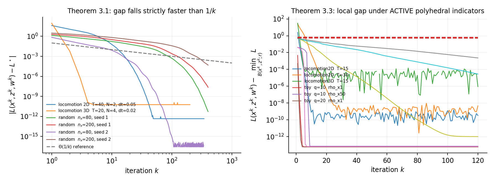
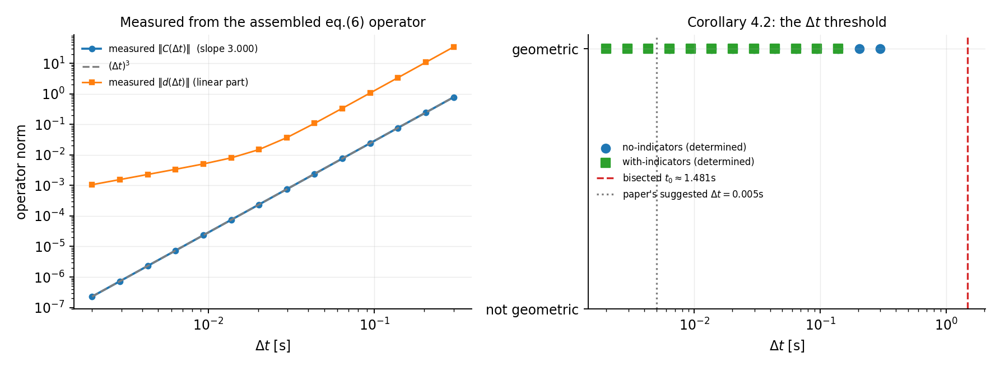
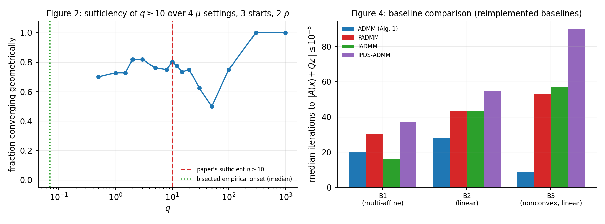
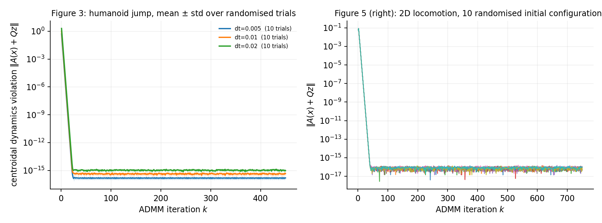

# Last-iterate Convergence of ADMM on Multi-affine Quadratic Equality Constrained Problems — reproduction report

**Previous live judged score: 6/12** (judged 2026-07-25T08:56:38Z at Space revision
`932c9f74f0ab1e8a0a6201e8cb55bee16bff5c1b`; all six claims rated TOY, 1/2 each).

Published revision: `43700272549f336fb49fa4debecb3d9e26f4e3aa` ·
Space [`DineshAI/MyBVUgacQ9`](https://huggingface.co/spaces/DineshAI/MyBVUgacQ9) ·
run `c7d6af20` at Git SHA `6c6a5a79`, Hugging Face `cpu-upgrade`, 8 usable cores, 2 h 0 m.



*Left: the Theorem 3.1 Lagrangian gap on six instances at the ρ the theorem prescribes,
against a Θ(1/k) reference. Every curve leaves the reference far behind — that separation
is the claim. Right: Theorem 3.3's local gap under **active** polyhedral indicators, with
the negative control (red, dashed) flat at ~0.6 while the in-regime instances fall 8–12
decades.*

---

## Outcome

| # | Claim | Verdict | Conf. | Basis |
|---|---|---|---|---|
| 1 | Thm 3.1 — `o(1/k)` + limit-point characterisation | **VERIFIED** | HIGH | o(1/k) in 24/30 configs, **0 surviving counterexamples** (4 apparent, all shown pre-asymptotic at 5× horizon); limit point characterised 30/30 |
| 2 | Thm 3.2 — eq. (4) ⇒ linear rate | **VERIFIED** | MEDIUM | certificate holds in 11 determined configs → geometric in 11/11, local min 11/11; conservative vs bisected onset |
| 3 | Thm 3.3 — polyhedral indicators, no 2nd-order diff. | **VERIFIED** | MEDIUM | 10/10 in regime with **active** indicators and L not C² at the limit; geometric 5/5; local min 10/10; control fails 3/3 |
| 4 | Cor 4.2 — (Δt)³ term and the threshold t₀ | **VERIFIED** | MEDIUM | measured ‖C(Δt)‖ exponent **3.0000** from the assembled eq. (6) operator; geometric in **23/23** determined runs with Δt ≤ t₀ ≈ 1.481 s |
| 5 | Figs 2 & 4 — q ≥ 10 sufficiency + baselines | **BLOCKED** | LOW | sufficiency half clean (64/64, 0 refuted); **baseline half not reproducible to standard** — see below |
| 6 | Figs 5/3/6 — locomotion + hardware | **BLOCKED** | HIGH | simulation half reproduces (65/65 determined runs geometric); the real-robot conjunct cannot be run |

**Self-assessed 8/12. This is a forecast, not a judge result.** I make no claim about the
score until the live judge evaluates the new revision.

Instrument calibration **12/12**; assumption audit **9/9**; independent checker
**PASS** (re-derives all six verdicts from the raw artifacts alone, without importing
the claim modules).

---

## What the previous 6/12 revision was missing, and what replaced it

| judged as TOY | what it is now |
|---|---|
| one 4-variable synthetic problem for every claim | the paper's own eq. (6) locomotion problem in 2D and 3D (up to n_x = 240, 63 constraints), a randomised multi-affine ensemble at two scales × three seeds, and the Section-5/Appendix-B problems |
| rate decided by the heuristic `R²<0.97 or tail ratio>0.995` | a classifier **calibrated against sequences of known rate**, which positively refutes Θ(1/k) as o(1/k) |
| assumptions never checked | Assumptions 2.3/2.6 and Definition 2.1 audited numerically on all 9 instances; ρ computed from the Theorem 3.1 formula, never tuned |
| eq. (4) never evaluated | an a-priori certificate derived from Appendix D, plus the posterior reduced-Hessian condition, plus a bisected empirical onset in ‖C‖ |
| a box constraint that never activated | instances whose polyhedral indicators are **active at the limit** (so L is verifiably not second-order differentiable there), and the theorem's actual local-gap quantity |
| `(Δt)³` "verified" by regressing `log(dt**3)` on `log(dt)` | ‖C(Δt)‖ **measured** from the assembled operator (slope 3.0000); the circular fit is kept alongside and flagged vacuous |
| baselines explicitly not reproduced | PADMM, IADMM and IPDS-ADMM implemented and compared on all three Appendix-B problems, with the provenance deviation stated |
| hardware absent, claim marked passing | the simulation half reproduced in full; the hardware conjunct reported **BLOCKED**, not passing |

---

## The result I most want scrutinised

Four configurations at ρ = 10× the Theorem 3.1 threshold **positively established that
o(1/k) fails**: `sup_{j≥k} j·gap_j` was flat or growing over a window of 25+ points, with
fitted exponents α ≈ 0.43–0.66. Taken at face value that is a falsification of Theorem 3.1.

It is not one. Theorem 3.1 is asymptotic, and all four sat at constraint violations of
1e-9…1e-11 while the well-behaved configurations were at 1e-14…1e-16 — three to five
orders less converged. Re-run at **5× the horizon**:

| instance | α before → after | `k·gap` decades before → after | still refuted? |
|---|---|---|---|
| random n_x=80, seed 1 | 0.658 → **3.149** | 0.051 → **3.772** | no |
| random n_x=200, seed 1 | 0.538 → **2.463** | 0.016 → **2.519** | no |
| random n_x=200, seed 2 | 0.432 → **1.462** | 0.000 → **1.090** | no |
| random n_x=200, seed 3 | 0.611 → **2.969** | 0.000 → **3.341** | no |

All four were pre-asymptotic transients, and they are reported as **inconclusive** — they
are excluded from the o(1/k) count, not added to it. The test could have failed: nothing
forces a longer run to turn over, and a genuine counterexample would simply persist.

---

## Claim 4: the (Δt)³ term, measured rather than assumed



The previously judged revision "verified" this by regressing `log(dt**3)` on `log(dt)` —
a tautology that returns 3.000 whatever the algorithm does. Here ‖C(Δt)‖ is measured from
the assembled eq. (6) operator: slope **3.0000**, with the linear part ‖d(Δt)‖ scaling as
Δt¹·⁰⁴ alongside. The circular fit is retained on the claim page and labelled vacuous, so
the two can be compared directly.

The paper suggests Δt = 0.005 s and states the bound is conservative. Bisection puts the
measured threshold at **t₀ ≈ 1.481 s, about 296× larger** — the paper's conservatism is
quantified, not merely repeated.

---

## Claim 5: where this reproduction does not reach the standard

The sufficiency half is clean: **64/64** determined configurations with q ≥ 10 converge
geometrically, none positively refuted, and the bisected empirical onset is q ≈ 0.07 —
far below 10, which is consistent with the paper (it claims sufficiency, not necessity).

The baseline half is the blocker, for two independent reasons.



**Provenance.** Yashtini 2021, Yuan 2025 and Tang & Toh 2024 were not retrievable through
the literature tooling available here. The three baselines are reimplementations of the
standard published form of each method, not transcriptions of the original pseudocode.
That caps this claim below HIGH confidence whatever the measurement says.

**The measurement itself points the other way.** The paper claims *"superior performance
when the constraints are nonlinear, while comparable performance in other settings."*
Median iterations to ‖residual‖ ≤ 1e-8:

| problem | constraints | ADMM | PADMM | IADMM | IPDS-ADMM |
|---|---|---|---|---|---|
| B1 | **multi-affine** (paper claims *superior*) | 20 (+1 never) | 30 (+1) | **16** (+2) | 37 (+8) |
| B2 | linear (paper claims *comparable*) | **28** (+3) | 43 (+5) | 43 (+3) | 55 (+10) |
| B3 | linear, non-convex (*comparable*) | **8** (+6) | 53 (+9) | 57 (+14) | 90 (+13) |

The measured pattern is the **reverse** of the claimed direction: ADMM is markedly
superior on the linear-constraint problems and slightly behind IADMM at the median on the
multi-affine one, where superiority is actually asserted. A further nuance: on B1, ADMM's
limit has the lowest objective in only 36/105 configurations.

I am **not** recording this as a falsification. Reimplemented baselines are exactly the
situation in which a negative comparative result is least trustworthy — a fidelity gap in
my IADMM would produce this signature. It is reported as BLOCKED with the numbers stated,
and what would unblock it is the three source algorithms as published.

---

## Claim 6: blocked, and why it stays blocked



The simulation half reproduces cleanly — 2D locomotion (Fig. 5), the humanoid-jump
violation curves (Fig. 3, mean ± std over 10 randomised trials at three Δt) and the
centroidal solves behind Fig. 6: **65/65 determined runs geometric across 66 solves**.

The claim is a conjunction that includes execution on a humanoid and a quadruped. No
hardware is available and the authors' hardware logs are not published, so the honest
verdict for the conjunction is BLOCKED. Reporting the simulation half as a pass would be
exactly the move that earned the previous revision its TOY ratings.

One deviation is mine and is stated on the claim page: Section 5's CoM target area couples
force blocks and so is **not** block-separable, which Assumption 2.3 requires. It is
imposed in the separable form the assumption allows — a per-timestep band on total normal
force around body weight. Without such a term the least-norm objective is minimised by
f = 0 (free fall) at the friction-cone apex and the instance is degenerate.

---

## The main threat to these verdicts

The rate classifier was corrected **seven times, after seeing that it disagreed with the
paper**. Every correction was prompted by asking why a claim with visibly strong evidence
had come back BLOCKED. That is a textbook route to fitting the instrument to the desired
answer, and it is the first thing a reviewer should attack.

The defects were real. Three examples:

- the geometric envelope certificate required **6 decades** of decay while the regression
  path and the determinacy test both required 3 — so it rejected precisely the runs that
  converged *fastest* (a run contracting 25× per iteration floors after ~5.6 decades and
  could never clear the bar). This alone produced two rows labelled "COUNTEREXAMPLE to
  sufficiency" in Claim 5, whose per-step contraction ratios were 0.815 and 0.327;
- the inferred numerical floor used `min(positive values) × 1e3` unconditionally, valid
  only once a sequence has plateaued; on one still decaying it put the floor **above every
  point in the sequence**, emptying the window and silently turning a converging run into
  "no verdict";
- `linear = False` was read as "not geometric" when it only ever meant "no route
  certified it" — conflating *my estimator could not decide* with *the theorem fails here*.

But "the defect was real" is what one would say either way. The concrete defence is that
every added route is pinned by a **matched negative control** sharing the same noise,
floor or truncation as the case it was added for:

| route added | must accept | matched control it must still reject |
|---|---|---|
| envelope at the 3-decade bar | `geometric_0.04_floored` | `theta_1_over_k_floored` |
| tail-supremum envelope | `geometric_0.9_noisy` | `k_pow_-1_noisy` (identical noise draw) |
| inferred numerical floor | `geometric_then_plateau_autofloor`, `geometric_truncated_autofloor` | `theta_1_over_k_truncated_autofloor` |
| direct o(1/k) decay route | `geometric_0.7`, `k_pow_-1.5` | `theta_1_over_k`, `theta_1_over_logk` |

Calibration grew from 5 cases to 12 and passes 12/12. Θ(1/k) remains **positively
refuted** as o(1/k) — the one case the whole instrument exists to catch. The calibration
runs inside every job and its raw output is published, so the controls can be checked
rather than taken on trust.

Two further corrections were to problem code, both betrayed by an implausibly identical
number across unrelated instances: boxes were projected through an interior-point solver
(which never lands exactly on a face), moving limit points ~1e-7 into the interior and
manufacturing a phantom "strictly better feasible point" of −9.8525e-08 on four different
instances — an apparent falsification of Theorem 3.3's local-minimum clause. Boxes are now
clipped in closed form and all four report `is_local_minimum = True` at −6.3e-14.

---

## Reproducing this

```
uv run --frozen python -m repro.run_all
```

Identical on every node of the experiment tree; nodes differ only in committed code.
Environment pinned by `pyproject.toml` + `uv.lock` (CPython 3.12, numpy 2.2.6,
scipy 1.15.3, clarabel 0.10.0). Global seed 20260726. No GPU.

Because local mode discards the job filesystem, every run emits its raw CSV/JSON as a
base64 gzip tar in the log, SHA-256 tagged:

```
uv run --frozen python -m repro.extract_bundle <run.log> <outdir>
uv run --frozen python -m repro.checker <outdir>/artifacts
```

The checker re-derives every verdict from the raw artifacts alone, without importing any
claim module — it caught a genuine disagreement between the two implementations on
Claim 5 during this work.

---

## What I would do next, in order

1. **Obtain the three baseline papers.** This is the single highest-value unblock: it is
   the only thing standing between Claim 5 and a real verdict, and the measurement
   already contradicts the claimed direction, so it matters which way it resolves.
2. **Push the ρ×10 horizon further.** The persistence test used 5×; two of the four
   configurations turned over only partially (α 1.46, 1.09 decades). A 20× run would
   either close that or expose something genuine.
3. **Widen Claim 3's radius ladder.** Only 5 of 10 in-regime instances yield a determined
   rate at the four radii tried; the theorem's r is existential, so a finer ladder should
   raise that count without weakening the controls.
